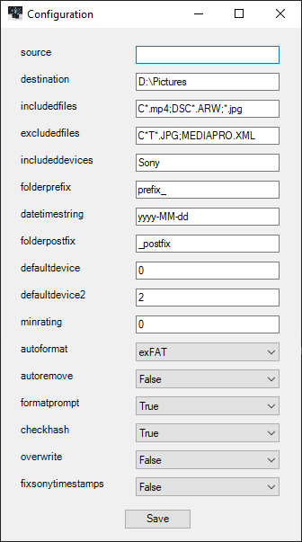
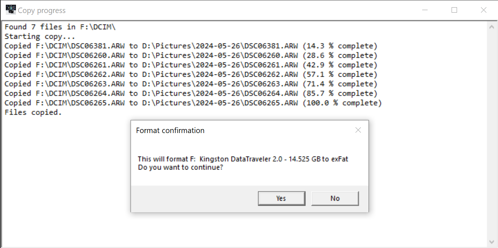

# CameraCopy

A straightforward Powershell GUI tool for copying files from memory card or camera to your computer.<br><br>
Scans the system for available volumes, filters the volume list by user keywords, checks file timestamps on source, creates a timestamped directory, copies files, checks sha256 hash, removes copied files and formats source volume. Does not overwrite already existing files, unless told to.

<br>
<br>


## Configuration

Edit cameracopy.json by hand or click the cogwheel icon.

```json
{
    "source": "DCIM\\",                 <- Source folder of images, does not have to be set. Will only use volume letter if not set
    "destination": "D:\\Pictures",      <- Destination folder for files, must have full path
    "includedfiles": [                  <- List of files to include in copy, cameras might have additional files. Set to "*" if you want to copy everything
        "*.arw",
        "*.mp4"
    ],
    "excludedfiles": [                  <- Files to exclude from copy progress. Can be left empty
        "*thumb*",
        "ABC06591.ARW"
    ],
    "includeddevices": [                <- Volume dropdown filter keywords. If left empty, all found volumes will be listed
        "Sony",
        "DataTraveler"
    ],
    "folderprefix": "prefix_",          <- Destination folder prefix
    "datetimestring": "yyyy-MM-dd",     <- Powershell datetime string used in destination folder. yyyy-MM-dd meaning 2024-01-01
    "folderpostfix": "_postfix",        <- Destination folder postfix.
    "defaultdevice": "0",               <- Default primary device, if you know your device is always e.g. second on the list set to 1
    "defaultdevice2": "0",              <- Default secondary device for multicard copying. 0 is always None
    "minrating":  "0",                  <- Sets a minimum metadata Rating for files. Does not copy if no rating is found. 0 is off
    "autoformat": "exFAT",              <- Select format filesystem on start. Can be empty or any of FAT32, exFAT, NTFS
    "autoremove": false,                <- Select remove files after copying on start
    "formatprompt": true,               <- Prompt before formatting, set to false if you want to format without confirmation (dangerous)
    "checkhash": true,                  <- When true, do a SHA256 hash check fo each file after copy (slows down process)
    "overwrite": false,                 <- Overwrite existing files
    "fixsonytimestamps": true           <- Sony cameras sometimes have different CreationDate for the video files than the actual shooting time. Get the actual time from XML
}
```

### Notes
* Copy source will always be '{selectedDrive}:\\{source}\\' e.g. 'F:\\DCIM\\'
* Copy destination will always be '{destination}\\{folderprefix}{datetimestring}{folderpostfix}\\' e.g. 'D:\Pictures\2024-01-01\\'
* Do not add a leading drive to source e.g. 'D:\\DCIM\\'
* folderprefix, folderpostfix and datetimestring can be left empty. Files are then copied to destination.
* autoformat and autoremove only affect which option is default in the gui.
* Does not support MTP devices. Devices must have an assigned volume letter.
* SHA256 hash check should not be necessary, since USB file transfer is error correcting. However if you suspect the integrity of the file transfer, you can enable the option. If a hash check fails, the source files that fail the hash check will not be removed, even when auto remove is enabled.
* If files fail the hash check, you will be prompted to delete the files.
* minrating 0< first checks the file metadata for Rating, if not found it looks it from $filename.xmp file. Files without rating are rated 0.
* Icons might be a bit off if you covert the script to exe with ps2exe.
* When format prompt is disabled, but files have failed hash check, a format prompt will be displayed.
* Primary and secondary volumes are both treated as separate volumes as default. CameraCopy will run the same copy/remove/format etc for both volumes. Useful if you have a camera with two memory card slots and want to copy files from both. Format prompt (unless disabled) will be displayed between volumes.
* About the "Is clone" checkbox: CameraCopy will assume both copy sources are identical and will check hash of existing files and not replace them. It will normally copy files that are not present in the destination folder. Mostly usable if you want to autoremove the copied files from the second memory card as well. It will only remove the files that has a matching sha256 hash as the file that is present in the destination.
* Some cameras might save files slightly differently depending on memory card type or some other random reasons. e.g. When you have Simultaneously saving enabled with Sony cameras, video files will have different hash, even when they are intact. It is recommend to to disable "Is clone" and just keep sha256 check enabled and format cards after copying. This way you'll know if transfer was successful and still have both memory cards copied and cleared.

#### Known bugs
* If you try to copy existing files to disk, Is clone enabled, overwrite disabled and autoremove enabled, CameraCopy will not replace any existing files, but will only remove the existing files from the second card if they have a matching sha256 hash. This should not be an issue in any real life scenarios, unless you like to spam copy button for fun try out different options.