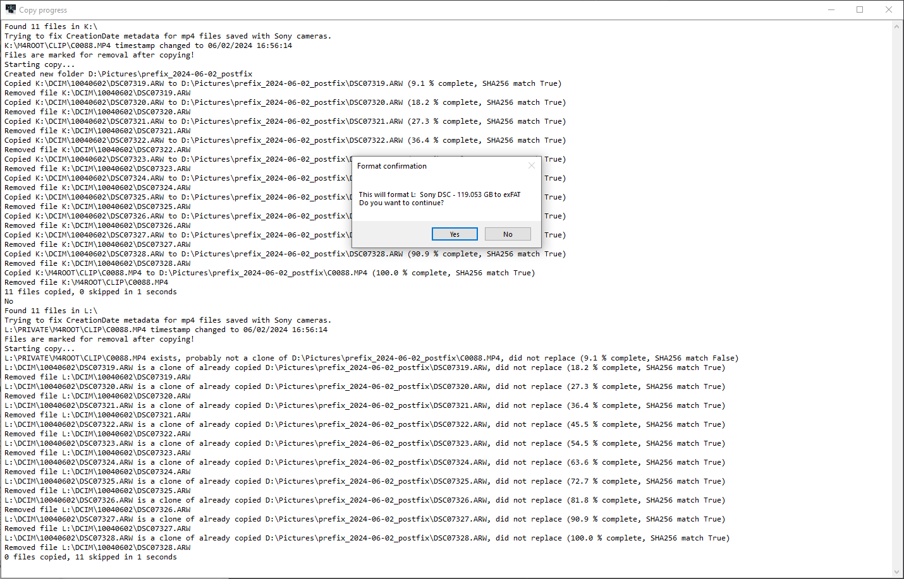

# CameraCopy

A straightforward Powershell GUI tool for copying files from memory card or camera to your computer.

<br>


## Configuration

Edit the cameracopy.json file as you please.<br>
Copy source will always be '{selectedDrive}:\\{source}\\' e.g. 'F:\DCIM\'<br>
Copy destination will always be '{destination}\\{datetimestring}\\' e.g. 'D:\Pictures\2024-01-01\\'<br>
Do not add a leading drive to source e.g. 'D:\\DCIM\\'<br>
Remember to escape backslashes('\\') in the json by using double backslashes ('\\\\')<br>
```json
{
    "source": "DCIM\\",                 <- Source folder of images, does not have to be set. Will only use volume letter if not set.
    "destination": "D:\\Pictures",
    "includedfiles": [                  <- List of files to include in copy, cameras might have additional files. set to "*" you want to copy everything.
        "*.arw",
        "*.mp4"
    ],
    "excludedfiles": [                  <- Files to exclude from copy progress. Can be left empty.
        "*thumb*",
        "ABC06591.ARW"
    ],
    "includeddevices": [                <- Volume dropdown filter keywords. If left empty, all found volumes will be listed.
        "Sony",
        "DataTraveler"
    ],
    "datetimestring": "yyyy-MM-dd",     <- Powershell datetime string. yyyy-MM-dd meaning 2024-01-01.
    "defaultdevice": 0,                 <- If you know your device is always e.g. second on the list set to 1.
    "autoremove": false,                <- Select remove files after copying on start
    "autoformat": "exFat",              <- Select format filesystem on start. Can be empty or any of FAT32, exFAT, NTFS
    "formatprompt": true                <- Prompt before formatting, set to false if you want to format without confirmation (dangerous).
    "checkhash": false                  <- When true, do a SHA256 hash check fo each file after copy (slows down transfer).
}
```

### Notes
* Does not support MTP devices. Devices must have an assigned volume letter.
* SHA256 hash check should not be necessary, since USB file transfer is error correcting. However if you suspect the integrity of the file transfer, you can enable the option. If a hash check fails, the source files that fail the hash check will not be removed, even when auto remove is enabled.
